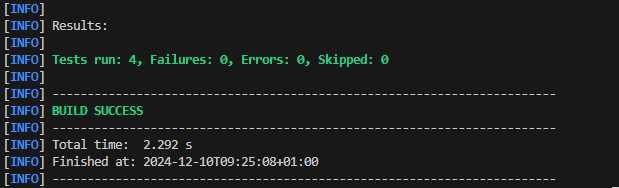
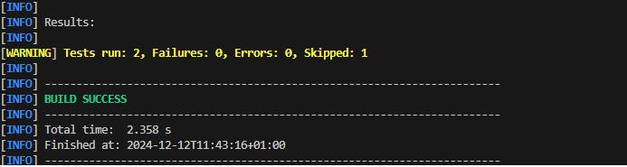
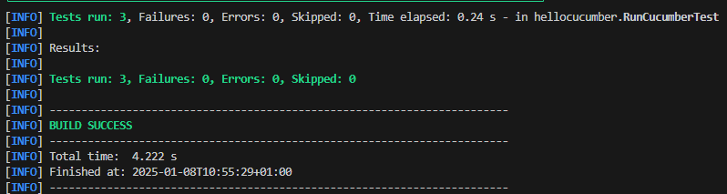
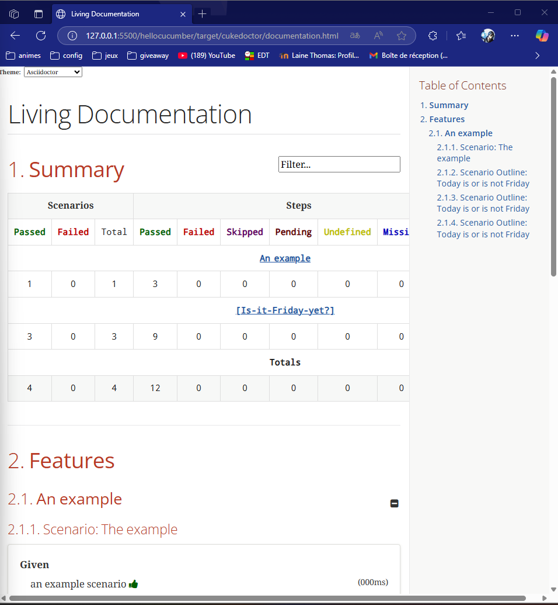
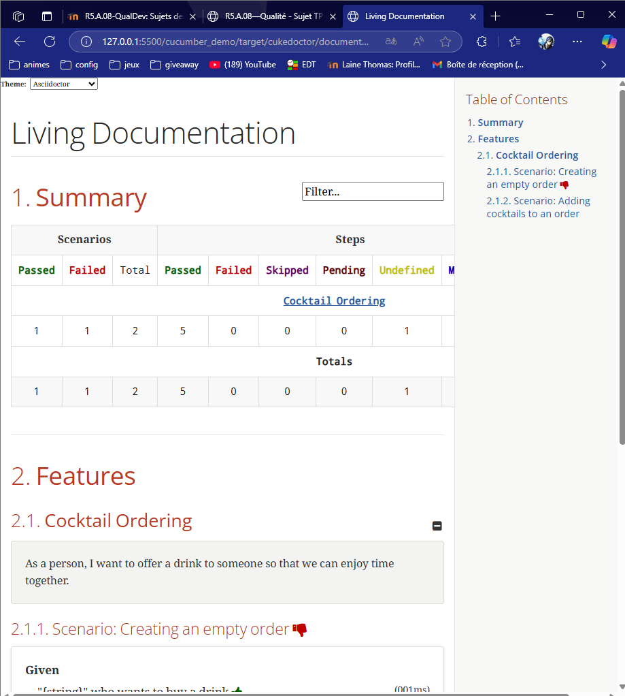
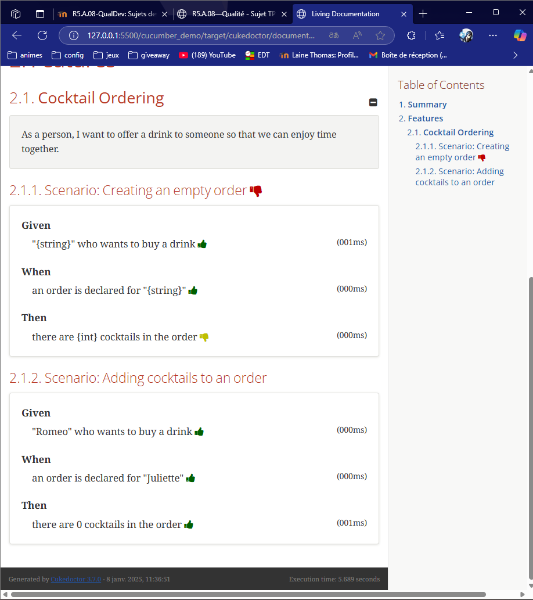
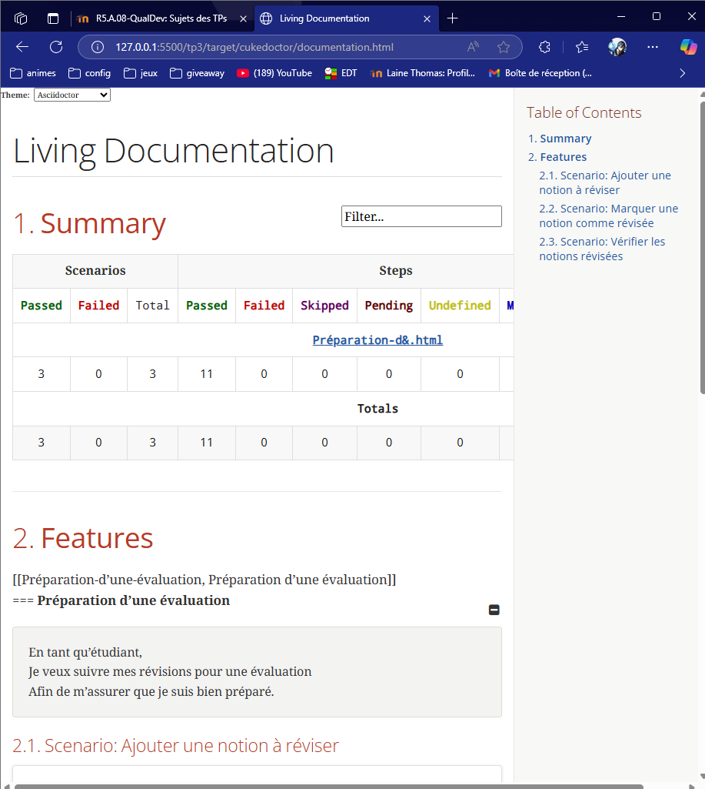
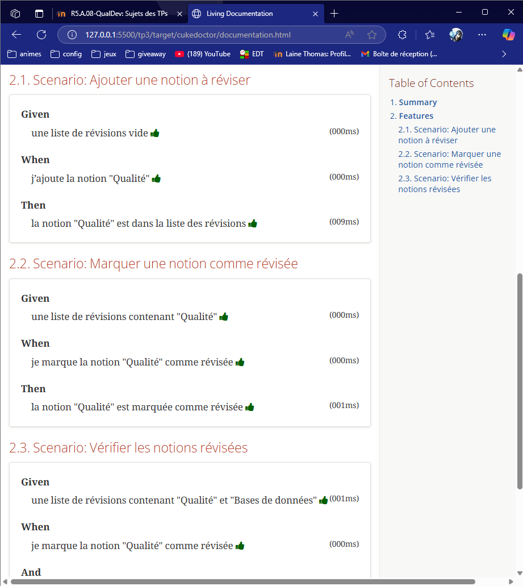

= R5.A.08 -- Dépôt pour les TPs
:icons: font
:MoSCoW: https://fr.wikipedia.org/wiki/M%C3%A9thode_MoSCoW[MoSCoW]

Ce dépôt concerne les rendus de mailto:A_changer@etu.univ-tlse2.fr[Thomas Lainé].

== TP1

.is_it_friday_yet.feature
[source,java]
---
Feature: Is it Friday yet?
  Everybody wants to know when it's Friday

  Scenario Outline: Today is or is not Friday
    Given today is "<day>"
    When I ask whether it's Friday yet
    Then I should be told "<answer>"

  Examples:
      | day            | answer |
      | Friday         | TGIF   |
      | Sunday         | Nope   |
      | anything else! | Nope   |
---

.screenshot de l'exécution des tests

== TP2

.Order.java
[source,java]
/*
 * Click nbfs://nbhost/SystemFileSystem/Templates/Licenses/license-default.txt to change this license
 * Click nbfs://nbhost/SystemFileSystem/Templates/Classes/Class.java to edit this template
 */
package dojo;

import java.util.ArrayList;
import java.util.List;

class Order {

    private String owner;
    private String target;
    private List<String> cocktails;

    public Order() {
        this.cocktails = new ArrayList<>();
    }

    public void declareOwner(String owner) {
        this.owner = owner;
    }

    public void declareTarget(String target) {
        this.target = target;
    }

    public void addCocktail(String cocktail) {
        this.cocktails.add(cocktail);
    }

    public List<String> getCocktails() {
        return this.cocktails;
    }
}

.screenshot de l'exécution des tests

== TP3

evaluation.feature

Feature: Préparation d'une évaluation
  En tant qu'étudiant,
  Je veux suivre mes révisions pour une évaluation
  Afin de m'assurer que je suis bien préparé.

  Scenario: Ajouter une notion à réviser
    Given une liste de révisions vide
    When j'ajoute la notion "Qualité"
    Then la notion "Qualité" est dans la liste des révisions

  Scenario: Marquer une notion comme révisée
    Given une liste de révisions contenant "Qualité"
    When je marque la notion "Qualité" comme révisée
    Then la notion "Qualité" est marquée comme révisée

  Scenario: Vérifier les notions révisées
    Given une liste de révisions contenant "Qualité" et "Bases de données"
    And la notion "Qualité" est marquée comme révisée
    When je vérifie les notions révisées
    Then je dois voir "Qualité" dans la liste des notions révisées
    And je ne dois pas voir "Bases de données" dans la liste des notions révisées

EvaluationSteps.java
[source,java]
package tp3;

import java.util.ArrayList;
import java.util.HashMap;
import java.util.List;
import java.util.Map;

import static org.junit.jupiter.api.Assertions.assertFalse;
import static org.junit.jupiter.api.Assertions.assertTrue;

import io.cucumber.java.en.Given;
import io.cucumber.java.en.Then;
import io.cucumber.java.en.When;

public class EvaluationSteps {

    private Map<String, Boolean> revisions = new HashMap<>();
    private List<String> revisedNotions = new ArrayList<>();

    @Given("une liste de révisions vide")
    public void uneListeDeRevisionsVide() {
        revisions.clear();
        System.out.println("Liste de révisions vide initialisée : " + revisions);
    }

    @Given("une liste de révisions contenant {string}")
    public void uneListeDeRevisionsContenant(String notion) {
        revisions.clear();
        revisions.put(notion, false);
        System.out.println("Révisions initiales : " + revisions);
    }

    @Given("une liste de révisions contenant {string} et {string}")
    public void uneListeDeRevisionsContenantDeuxNotions(String notion1, String notion2) {
        revisions.clear();
        revisions.put(notion1, false);
        revisions.put(notion2, false);
        System.out.println("Révisions initiales : " + revisions);
    }

    @When("j'ajoute la notion {string}")
    public void jAjouteLaNotion(String notion) {
        revisions.put(notion, false);
        System.out.println("Notion ajoutée : " + notion + " - Révisions actuelles : " + revisions);
    }

    @When("je marque la notion {string} comme révisée")
    public void jeMarqueLaNotionCommeRevisée(String notion) {
        if (revisions.containsKey(notion)) {
            revisions.put(notion, true);
            System.out.println("Notion marquée comme révisée : " + notion);
        } else {
            throw new IllegalArgumentException("La notion " + notion + " n'existe pas dans la liste des révisions.");
        }
    }

    @When("je vérifie les notions révisées")
    public void jeVerifieLesNotionsRevisées() {
        revisedNotions.clear();
        for (Map.Entry<String, Boolean> entry : revisions.entrySet()) {
            if (entry.getValue()) {
                revisedNotions.add(entry.getKey());
            }
        }
        System.out.println("Notions révisées : " + revisedNotions);
    }

    @Then("la notion {string} est dans la liste des révisions")
    public void laNotionEstDansLaListeDesRevisions(String notion) {
        assertTrue(revisions.containsKey(notion), "La notion " + notion + " n'est pas dans la liste des révisions.");
    }

    @Then("la notion {string} est marquée comme révisée")
    public void laNotionEstMarqueeCommeRevisée(String notion) {
        assertTrue(revisions.getOrDefault(notion, false), "La notion " + notion + " n'est pas marquée comme révisée.");
    }

    @Then("je dois voir {string} dans la liste des notions révisées")
    public void jeDoisVoirDansLaListeDesNotionsRevisées(String notion) {
        assertTrue(revisedNotions.contains(notion), "La notion " + notion + " n'est pas dans la liste des notions révisées.");
    }

    @Then("je ne dois pas voir {string} dans la liste des notions révisées")
    public void jeNeDoisPasVoirDansLaListeDesNotionsRevisées(String notion) {
        assertFalse(revisedNotions.contains(notion), "La notion " + notion + " est dans la liste des notions révisées.");
    }
}

Avec la feature je voulais rendre de meilleure qualité mes révisions avant les évaluations ainsi que me tenir à jours.

.screenshot de l'exécution des tests

== TP4

Documentation tp1 générée avec cukedoctor

Documentation tp2 générée avec cukedoctor

Documentation tp3 générée avec cukedoctor

